**T02: Missió Apache**

> **“Esta práctica no consiste en crear una página web, sino en configurar un servidor web profesional completo con Apache, multisitio, HTTPS, certificados SSL, error personalizado y soporte HTTP/2.”**

**Autor:** Santiago · **Lista 10**\
**Entorno:** Ubuntu Server (VM) + VirtualBox\
**Estado:** Completada con éxito y verificada con pruebas y capturas\
**Extra incluido:** Acceso desde cliente Windows en red **Host‑Only**

***

## Objetivo de la práctica

Configurar en **una sola máquina Ubuntu Server** un **servidor Apache 2.4** con:

*   **Multidominio** (VirtualHosts): `projectenexus10.test` y `academia10.test`
*   **Error 404 personalizado**
*   **SSL/HTTPS** con certificado **autosignado** (RSA 2048 · 365 días · **SAN** para ambos dominios)
*   **Redirección** de **HTTP → HTTPS**
*   **HTTP/2** activado y comprobado


***

## Redes y adaptadores VirtualBox

Para el **servidor Ubuntu**:

*   **Adaptador 1:** NAT (salida a Internet)
*   **Adaptador 2:** Host‑Only (laboratorio local) → IP 192.168.56.X

Para el **cliente Windows 11** *(EXTRA)*:

*   **Adaptador 1:** NAT
*   **Adaptador 2:** Host‑Only → IP 192.168.56.Y

> **Comprobación en Ubuntu:**

```
ip a
```

> **Comprobación en Windows (PowerShell):**

```
ipconfig
```

***

## Fase 1 — Instalación y configuración base

### 1) Instalar Apache2

```
sudo apt update && sudo apt install -y apache2
```
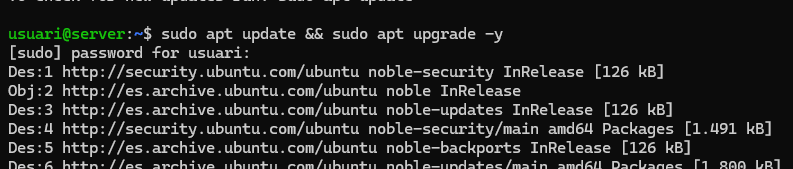

### 2) Verificar servicio y configuración

```
systemctl status apache2
```
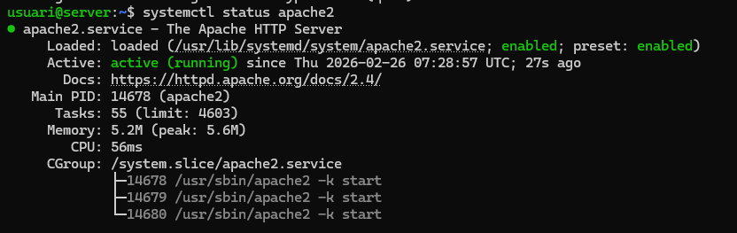

> Si aparece el aviso del FQDN, definir `ServerName` global:

```
echo 'ServerName localhost' | sudo tee /etc/apache2/conf-available/servername.conf
```

```
sudo a2enconf servername && sudo apachectl configtest && sudo systemctl reload apache2
```
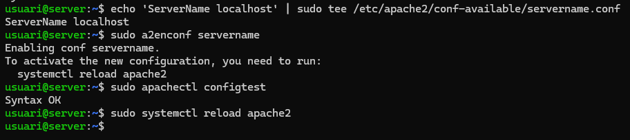

### 3) Confirmar usuario y permisos web

```
ls -ld /var/www
```


```
ps aux | grep apache2
```


## Fase 2 — VirtualHosts multidominio y UFW — permitir HTTP/HTTPS

### 1) Estructura de directorios

```
sudo mkdir -p /var/www/projectenexus10.test/public_html
```
```
sudo mkdir -p /var/www/academia10.test/public_html
```
```
sudo chown -R www-data:www-data /var/www/projectenexus10.test /var/www/academia10.test
```
```
sudo chmod -R 755 /var/www
```

### 3) Confirmar usuario y permisos web

```
ls -ld /var/www
```

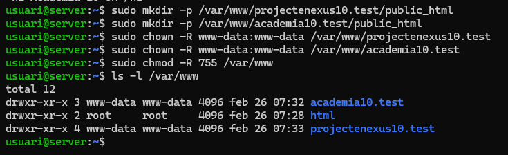

```
sudo ufw allow "Apache Full" && sudo ufw enable && sudo ufw status
```

### 2) Páginas de prueba

```
echo "<h1>Projecte Nexus 10 OK</h1>" | sudo tee /var/www/projectenexus10.test/public_html/index.html
```

```
echo "<h1>Academia 10 OK</h1>" | sudo tee /var/www/academia10.test/public_html/index.html
```
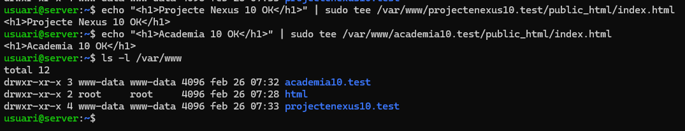

### 3) VirtualHost HTTP — `projectenexus10.test`

```
sudo nano /etc/apache2/sites-available/projectenexus10.test.conf 
```
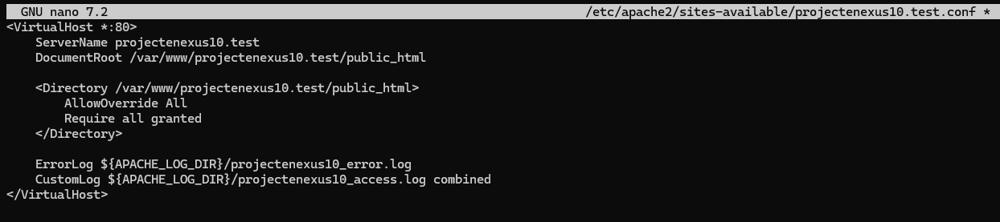

Y lo configuramos de esta manera en este caso 

### 4) VirtualHost HTTP — `academia10.test`

```
sudo nano /etc/apache2/sites-available/academia10.test.conf
```
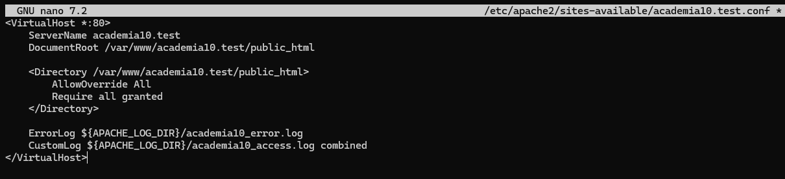

Y lo configuramos de esta manera en este caso 

### 5) Activar sitios y recargar

```
sudo a2ensite projectenexus10.test.conf academia10.test.conf && sudo apachectl configtest && sudo systemctl reload apache2
```
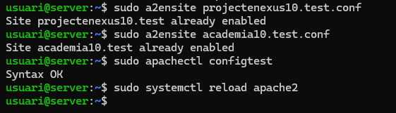

### 6) Resolver dominios en **Ubuntu Server** (`/etc/hosts`)

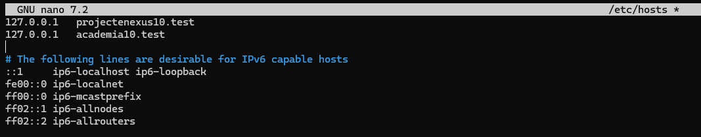

Ponemos los 2 dominios que queremos alojar en nuestro server.

### 7) Probar con `curl`

```
curl http://projectenexus10.test
```

```
curl http://academia10.test
```

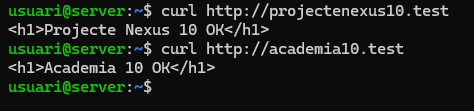

***

## Fase 3 — Error 404 personalizado

### 1) Crear el archivo (lo editas a mano)

```
sudo mkdir -p /var/www/projectenexus10.test/public_html/errors
```

``` 
sudo touch /var/www/projectenexus10.test/public_html/errors/404.html
```
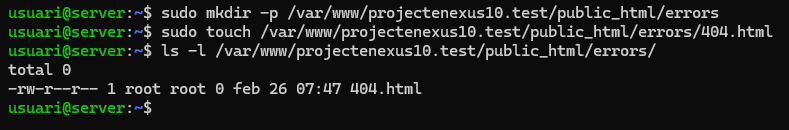

```
sudo nano /var/www/projectenexus10.test/public_html/errors/404.html
```

> **Plantilla sugerida (para pegar dentro de nano):**
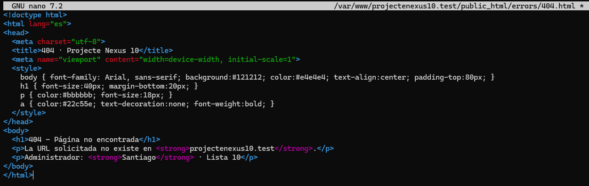
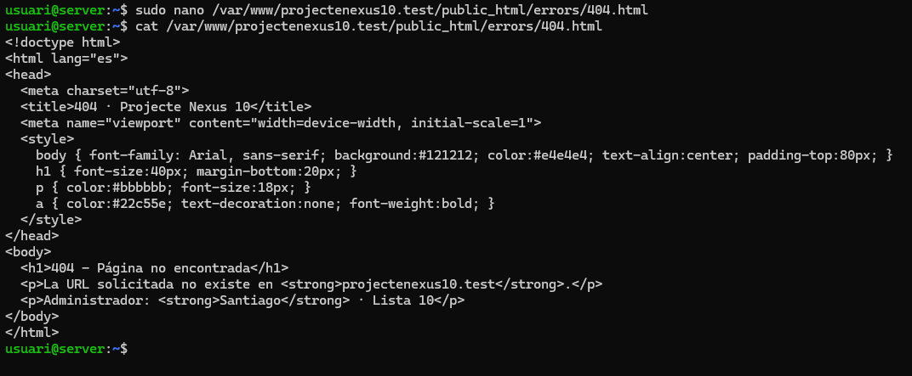


### 2) Asociar el ErrorDocument **en HTTP** (80)

```
sudo nano /etc/apache2/sites-available/projectenexus10.test.conf
```
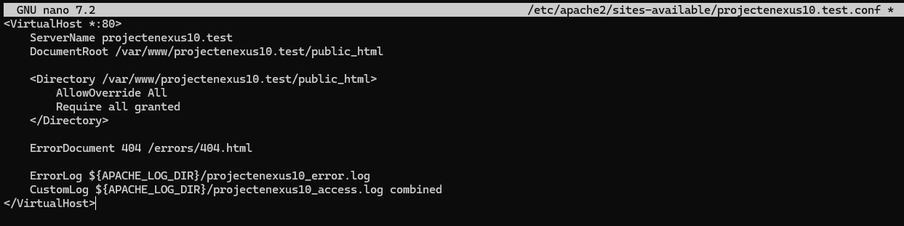

```
sudo apachectl configtest 
```
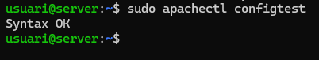

### 3) Probar el 404 (antes de SSL)

```
curl -i http://projectenexus10.test/no-existe
```
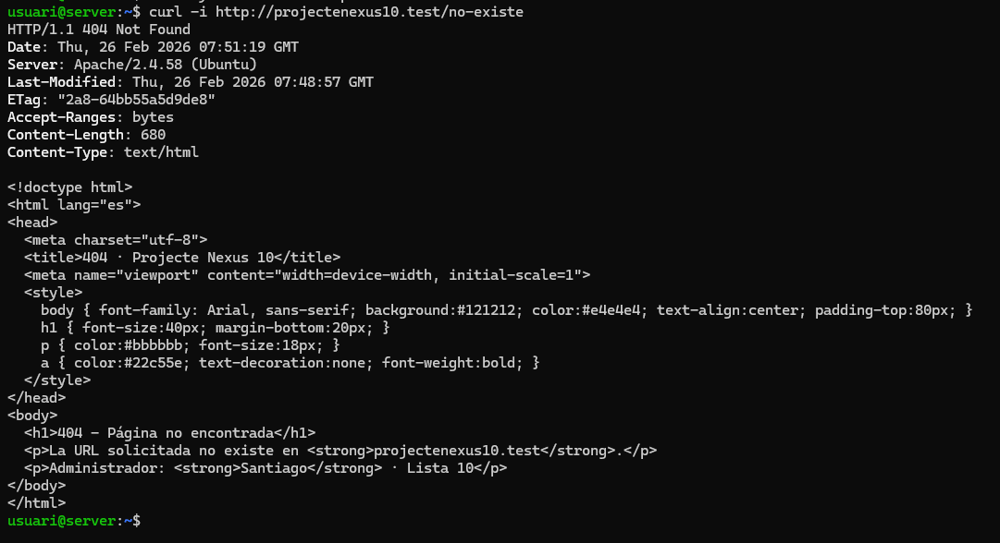

***

## Fase 4 — SSL/HTTPS con SAN

### 1) Activar módulo SSL

```
sudo a2enmod ssl 
```
```
sudo systemctl reload apache2
```
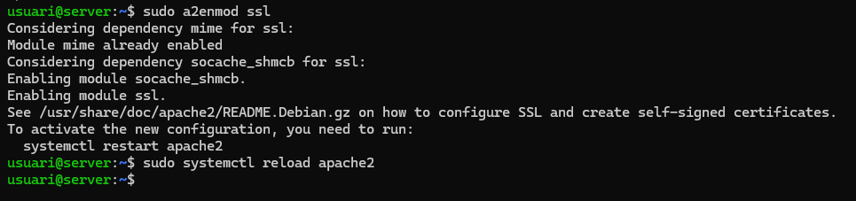

### 2) Config de OpenSSL con **SAN** (ambos dominios)

```
sudo nano /tmp/openssl-san.conf
```
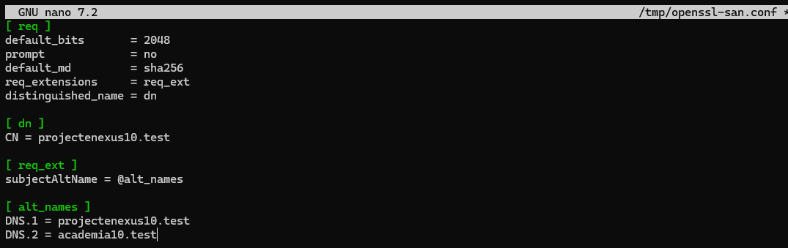

### 3) Generar certificado autosignado (RSA 2048 · 365 días)

```
sudo openssl req -x509 -nodes -days 365 -newkey rsa:2048 -keyout /etc/ssl/private/apache-selfsigned.key -out /etc/ssl/certs/apache-selfsigned.crt -config /tmp/openssl-san.conf
```
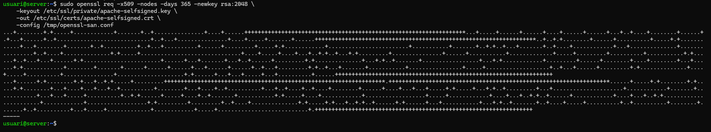

### 4) VirtualHost HTTPS — `projectenexus10.test`

```
sudo nano /etc/apache2/sites-available/projectenexus10-ssl.conf 
```

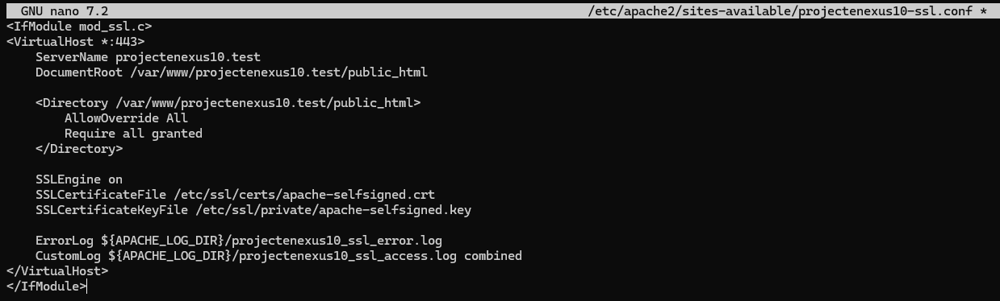

### 5) VirtualHost HTTPS — `academia10.test`

```
sudo nano /etc/apache2/sites-available/academia10-ssl.conf
```
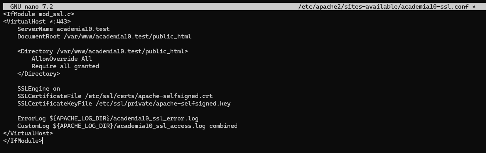


### 6) Activar sitios HTTPS y recargar

```
sudo a2ensite projectenexus10-ssl.conf academia10-ssl.conf && sudo apachectl configtest && sudo systemctl reload apache2
```
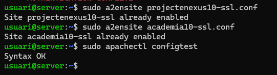

### 7) Redirección **HTTP → HTTPS** (en ambos sitios HTTP)

```
sudo nano /etc/apache2/sites-available/projectenexus10.test.conf
```
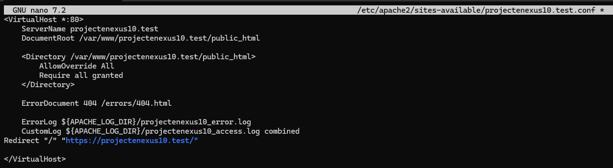

```
sudo nano /etc/apache2/sites-available/academia10.test.conf
```
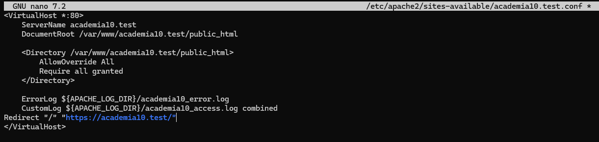

```
sudo apachectl configtest && sudo systemctl reload apache2
```
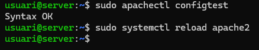

***

## Fase 5 — Optimización HTTP/2

### 1) Activar módulo y configurar `Protocols`

```
sudo a2enmod http2 && sudo systemctl reload apache2
```
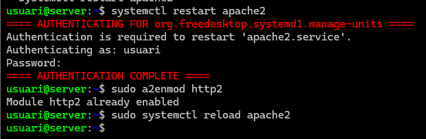

Añadir `Protocols` a ambos **VirtualHost HTTPS**:

*   `projectenexus10-ssl.conf`
*   `academia10-ssl.conf`

```
sudo nano /etc/apache2/sites-available/projectenexus10-ssl.conf
```

```
sudo nano /etc/apache2/sites-available/academia10-ssl.conf
```

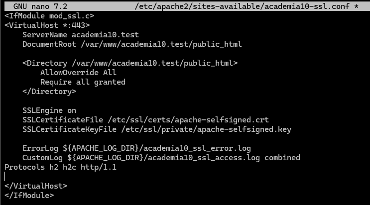

```
sudo apachectl configtest 
```

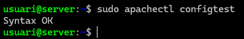

***

##  Pruebas con `curl` y navegador

### HTTPS en ambos dominios (respuesta 200)

```
curl -I --http2 -k https://projectenexus10.test
curl -I --http2 -k https://academia10.test
```

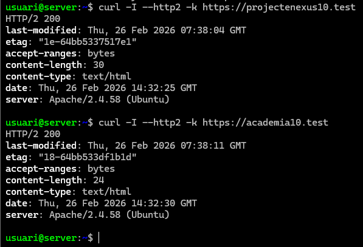


***

## Solución de problemas comunes

*   **Warning FQDN en `configtest`**\
    Solución: `ServerName localhost` en `conf-available/servername.conf`.

*   **Error de sintaxis en VirtualHost**\
    Mensajes como *“directive missing closing ‘>’”* → revisar comillas y `</VirtualHost>`.

*   **404 personalizado no aparece en HTTPS**\
    **Causa:** `ErrorDocument 404` agregado solo al VirtualHost HTTP (80).\
    **Solución:** añadir también al VirtualHost **HTTPS (443)**.

*   **Desde Windows no resuelve los dominios** *(EXTRA opcional)*\
    Añadir en **hosts de Windows** la IP Host‑Only del servidor:\
    `C:\Windows\System32\drivers\etc\hosts`
    192.168.56.117    projectenexus10.test
    192.168.56.117    academia10.test

***

## Cliente Windows en red Host‑Only

**Objetivo:** Simular un entorno real donde un cliente Windows accede al servidor Ubuntu en red privada.

### 1) Ver conectividad

```
ping 192.168.56.117
```
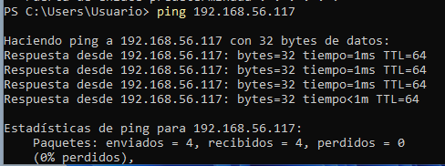

### 2) Hosts de Windows (como admin)

Ruta: `C:\Windows\System32\drivers\etc\hosts`\
Contenido a añadir:

    192.168.56.117    projectenexus10.test
    192.168.56.117    academia10.test

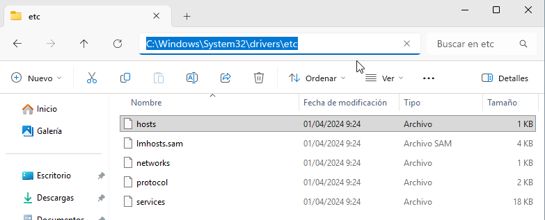
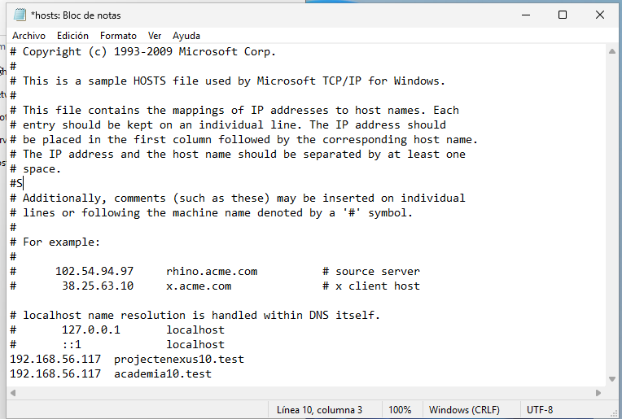


### 3) Probar en navegador

*   `https://projectenexus10.test`

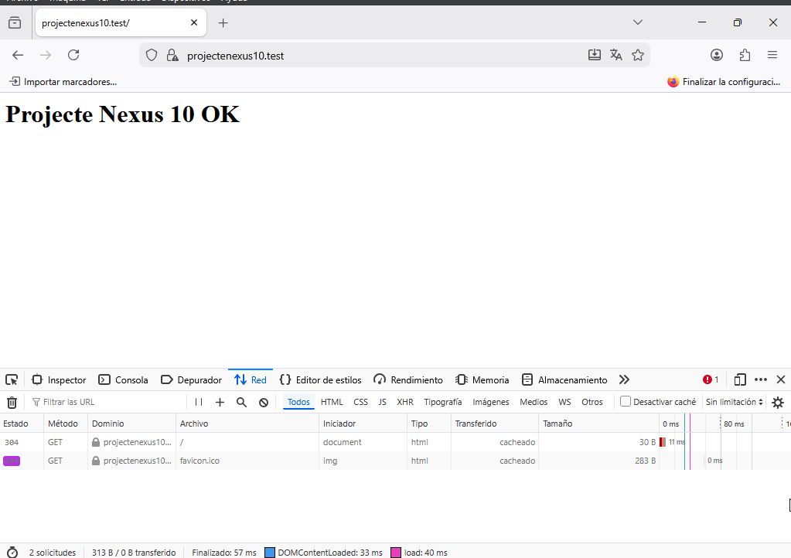

*   `https://projectenexus10.test/no-existe` → **404 personalizado**

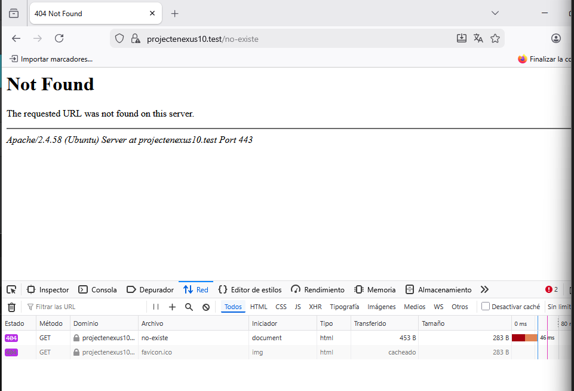

*   DevTools → Network 


>
> “En esta extensión se configuró una red Host‑Only entre dos VMs (Ubuntu Server y Windows 11). El cliente Windows resolvió los dominios locales mediante su archivo `hosts` y accedió por HTTPS/HTTP2 al servidor, validando la redirección y el 404 personalizado. Esta extensión simula un entorno real cliente‑servidor para pruebas de infraestructura.”

***

## Apéndice — Archivos de configuración finales


**`/etc/apache2/sites-available/projectenexus10-ssl.conf` (HTTPS)**

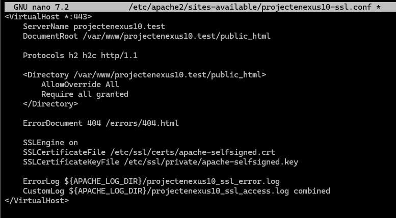

Para perzonalizar un poco

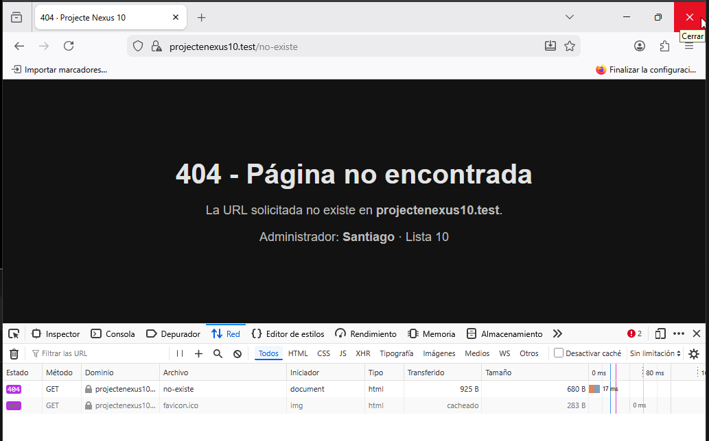

***

##  Cierre


