# Proyecto Nexus — PoC PKI Corporativa y Firma Digital (Grupo 8)

**Autores**:

*   **Administrador (Servidor Ubuntu)**: *Santiago. Moreno* 
*   **Cliente (Windows 11)**: *Santiago. Hernández*

**Entorno**: VirtualBox (NAT + Host‑Only)

***

## 1. Objetivo

Demostrar una **PKI corporativa propia** (CA interna) que permita:

*   Emitir **certificados de usuario** para empleados.
*   Instalar los certificados en **Windows 11**.
*   **Firmar digitalmente** un PDF con **Adobe Acrobat Reader** y **validar** la firma.

***

## 2. Arquitectura y direccionamiento

*   **Servidor CA (Ubuntu Server)**
    *   Nombre (FQDN): `ca.nexus8.test`
    *   IP Host-only (Grupo A, nº 17): `192.168.2.17/24` (sin GW ni DNS)
    *   IP NAT: DHCP (10.0.2.x)

*   **Cliente (Windows 11)**
    *   IP Host-only (Grupo A, nº 10): `192.168.2.10/24` (sin GW ni DNS)
    *   IP NAT: DHCP (10.0.2.x)

**VirtualBox (ambas VMs)**

*   Adaptador 1: **NAT**
*   Adaptador 2: **Red solo‑anfitrión** (Host‑Only)

Justificación: en WiFi, el modo Puente puede fallar. Host‑Only + NAT es estable y cumple los requisitos de la práctica.

***

## 3. Fase 1 — Preparación de VMs y Red

### 3.1. Cliente (Windows 11) — VM

*   2 vCPU, 4 GB RAM (recomendado 6–8 GB), 40 GB disco dinámico.
*   **BIOS/Legacy** (EFI desactivado).
*   Red:
    *   Adaptador 1: NAT
    *   Adaptador 2: Host‑Only

**Snapshot inicial**: `Cliente-Inicial`.

### 3.2. Servidor (Ubuntu Server) — VM

*   2 vCPU, 2 GB RAM, 20 GB disco dinámico.
*   **BIOS/Legacy** (EFI desactivado).
*   Red:
    *   Adaptador 1: NAT
    *   Adaptador 2: Host‑Only

**Snapshot inicial**: `Servidor-Inicial`.


***

## 4. Fase 2 — Instalación y configuración del Servidor CA (Ubuntu)

### 4.1. Instalación de Ubuntu Server

*   Idioma: Español.
*   Teclado: Español.
*   Interfaz NAT en **DHCP**.
*   Interfaz Host‑Only **estática**:
        IP: 192.168.2.17/24
        Gateway: (vacío)
        DNS: (vacío)
*   Hostname: **ca.nexus8.test**
*   Instalar **OpenSSH Server**.

**Comprobaciones**:

```
hostname            # ca.nexus8.test
ip a                # Ver 10.0.2.x (NAT) y 192.168.2.17/24 (Host-Only)
ping -c 3 google.com
```

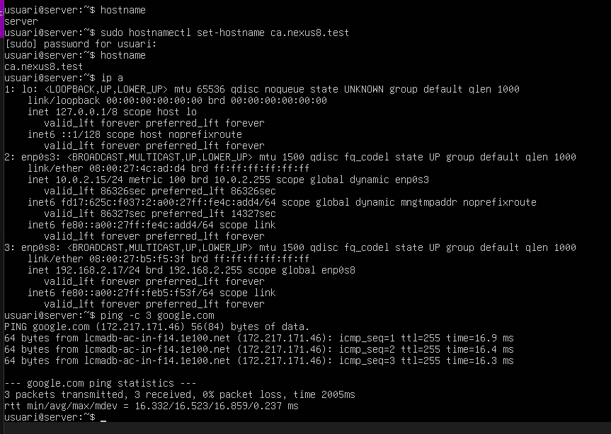

### 4.2. Actualización y SSH

```
sudo apt update && sudo apt upgrade -y
sudo systemctl enable --now ssh
sudo systemctl status ssh   # Active (running)
```

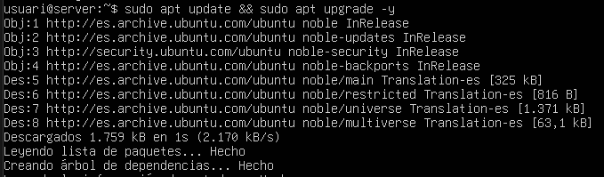

Si ssh esta desactivado entonces: 
```
sudo systemctl enable ssh
sudo systemctl start ssh
```

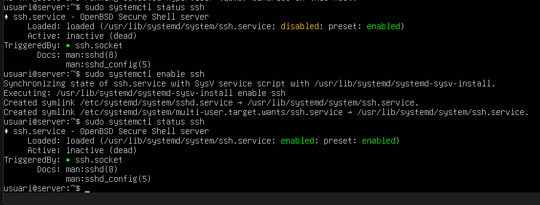

***

## 5. Fase 3 — Configuración de OpenSSL y creación de la CA

### 5.1. Estructura de la CA

```
sudo mkdir -p /etc/ssl/CA/{certs,crl,newcerts,private}
sudo touch /etc/ssl/CA/index.txt
echo "C001" | sudo tee /etc/ssl/CA/serial
sudo chmod 700 /etc/ssl/CA/private
```

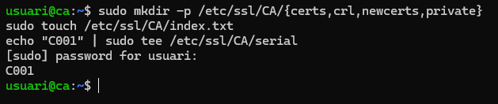
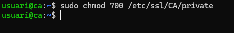
### 5.2. Configuración de `openssl.cnf`

Editar:

```
sudo nano /etc/ssl/openssl.cnf
```

Añadir/normalizar el bloque (sin duplicados):

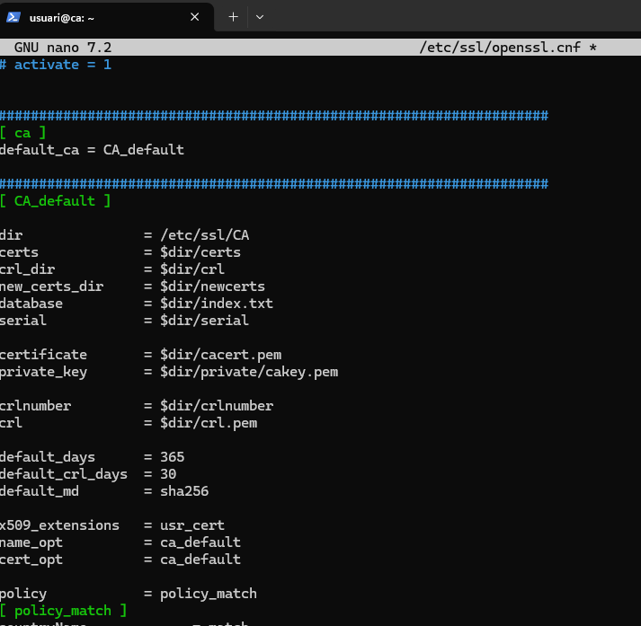
Prueba con: 

```
grep -A20 "\[ CA:default \ ]" /etc/ssl/openssl.cnf
```

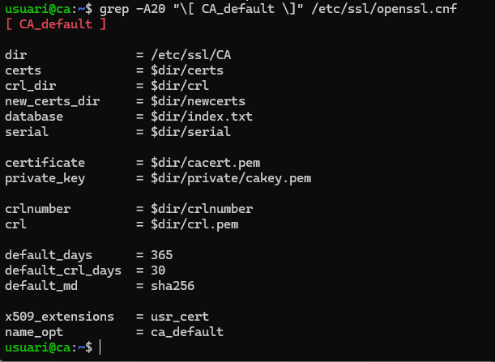

### 5.3. Crear clave privada y certificado raíz (CA)

```
sudo openssl req -new -x509 -days 3650 \
  -keyout /etc/ssl/CA/private/cakey.pem \
  -out /etc/ssl/CA/cacert.pem
```

**Valores recomendados**:

*   C: `ES`
*   ST/L: `Barcelona`
*   O: `Nexus 8`
*   OU: `CA`
*   **CN: `ca.nexus8.test`** (crítico)
*   Email: `admin@nexus8.test`
*   Pass CA: `nexusCA123` (memorizada para firmar)


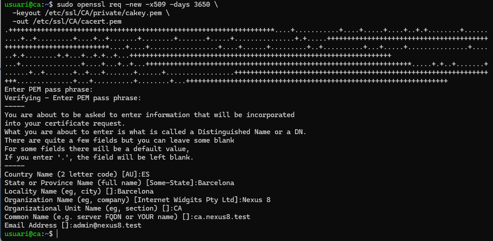

Prueba/verifica con: 

```
ls -l /etc/ssl/CA ls -l /etc/ssl
```

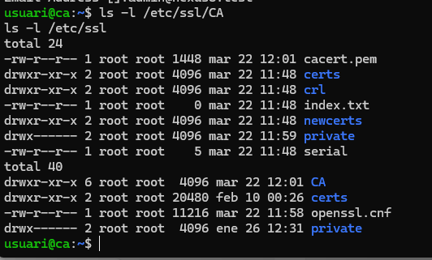

***

## 6. Fase 4 — Certificado de Usuario (Cliente)

### 6.1. Clave y CSR (solicitud)

```
openssl req -new -keyout userkey.pem -out userreq.csr
```

**Valores**:

*   C: `ES`, ST/L: `Barcelona`
*   O: `Nexus 8`, OU: `Users`
*   **CN**: `Santiago Hernandez`
*   Email: `hernandez@nexus8.test`
*   Pass clave usuario (PFX): **`123456`**

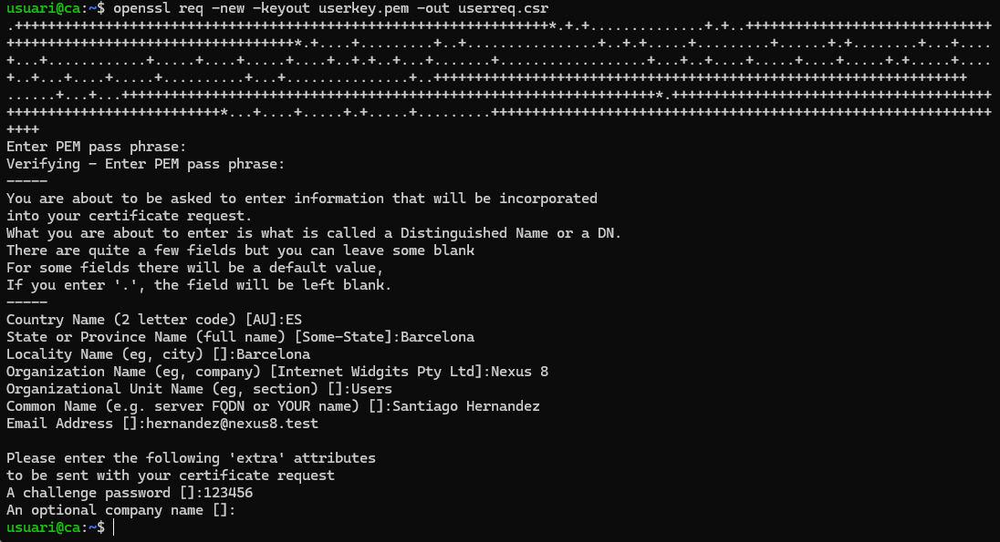

### 6.2. Firmar el certificado con la CA

```
sudo openssl ca -in userreq.csr -out usercert.pem
```

Pass de la CA: nexusCA123
Responder 'y' a la firma

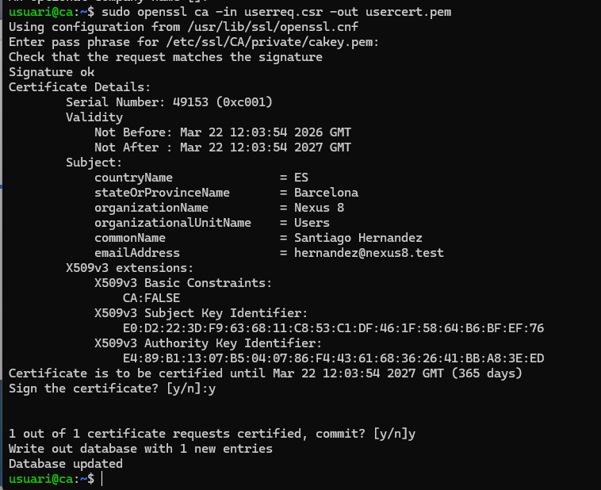

### 6.3. Exportar a PKCS#12 (para Windows)

```
openssl pkcs12 -export -out CertUser.pfx -inkey userkey.pem -in usercert.pem
```
Contraseña exportación: 123456

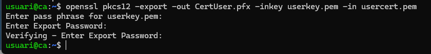

Comprovar:

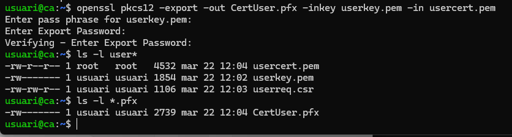

***

## 7. Fase 5 — Distribución de Certificados

### 7.1. Vía SCP (básico)

Permisos temporales:

```
sudo chmod 777 /etc/ssl/CA/cacert.pem
sudo chmod 777 CertUser.pfx
```

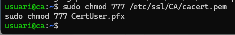

Desde **Windows (PowerShell)**:

```
scp usuari@192.168.2.17:/etc/ssl/CA/cacert.pem C:\Users\cliente\Desktop\
```
```
scp usuari@192.168.2.17:/home/usuari/CertUser.pfx C:\Users\cliente\Desktop\
```

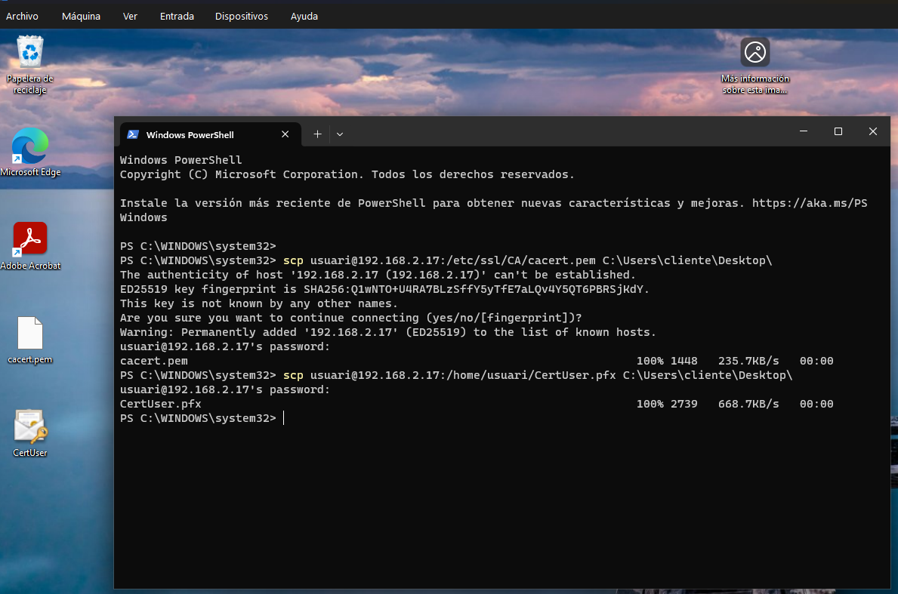

***

## 8. Fase 6 — Configuración del Cliente (Windows 11)

### 8.1. IP estática (Host‑Only)

    Adaptador: VirtualBox Host‑Only Ethernet Adapter
    IPv4 manual:
      IP: 192.168.2.10
      Máscara: 255.255.255.0
      Puerta de enlace: (vacío)
      DNS: (vacío)

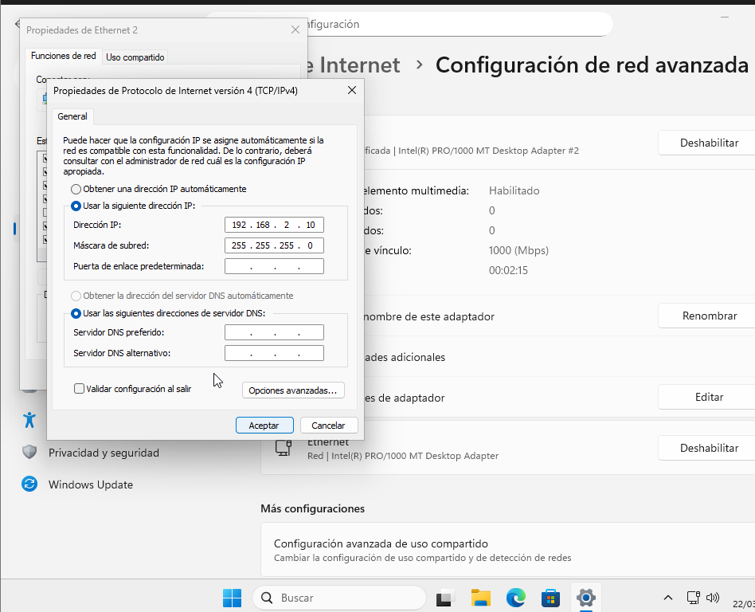

**Comprobación**:

```
ping 192.168.2.17
```

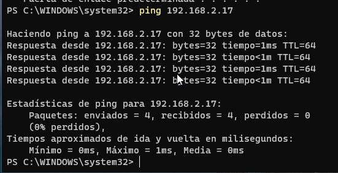

```
ipconfig
```

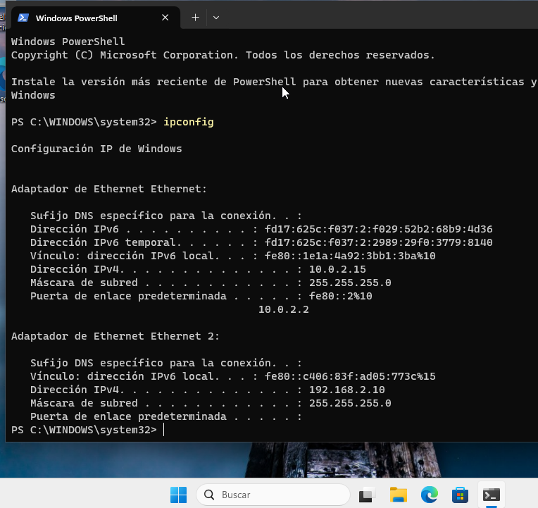

### 8.2. Resolver el FQDN del servidor

Editar `C:\Windows\System32\drivers\etc\hosts` (Bloc de notas como admin) y añadir:

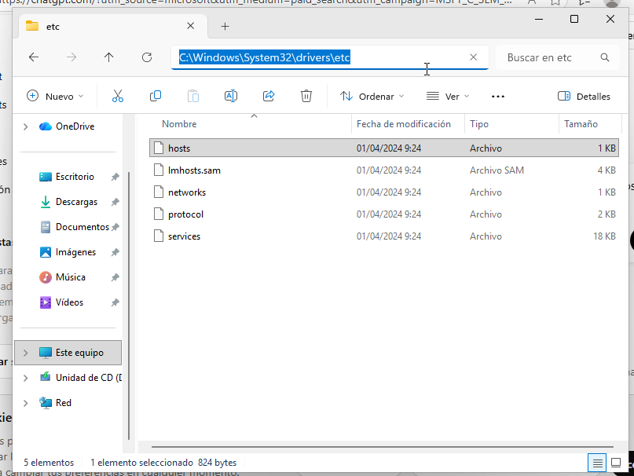

    192.168.2.17   ca.nexus8.test

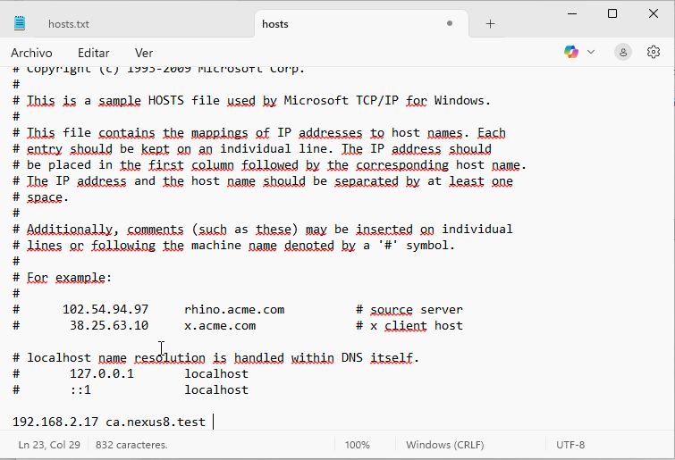

**Comprobación**:

```
ping ca.nexus8.test
```

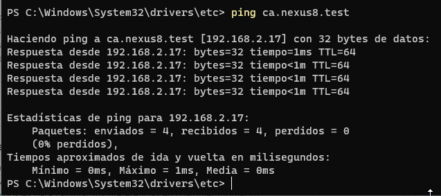

### 8.3. Instalar Adobe Reader (winget)

```
winget install Adobe.Acrobat.Reader.64-bit --accept-source-agreements --accept-package-agreements
```

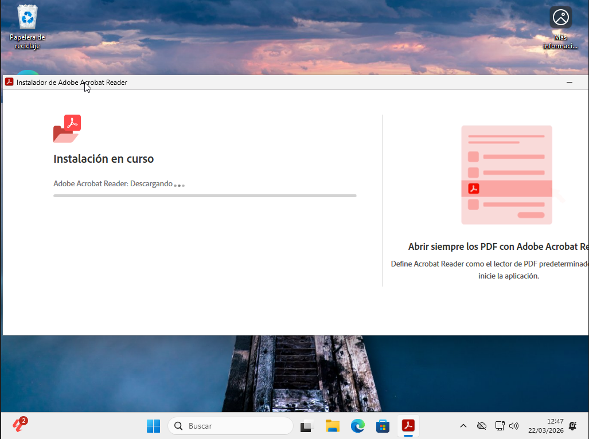

### 8.4. Instalar **certificado raíz** de la CA

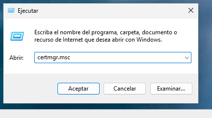

*   `certmgr.msc` → **Entidades emisoras de certificados raíz de confianza → Certificados**
*   Botón derecho → **Importar** → `cacert.pem`
*   **Colocar en este almacén**: *raíz de confianza*.

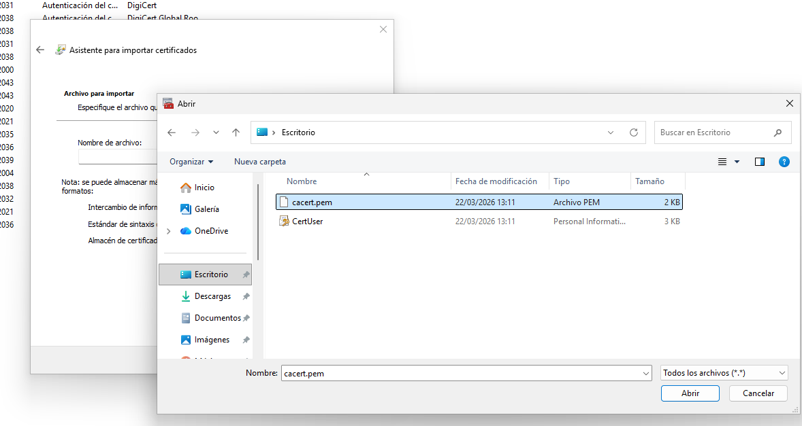
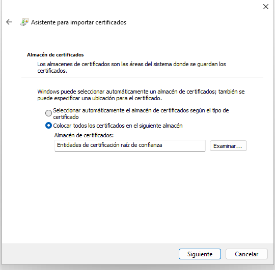
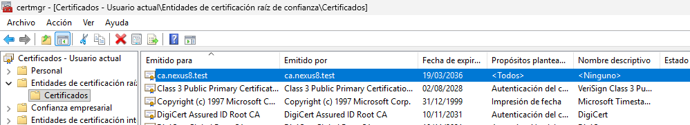

### 8.5. Instalar **certificado personal** (PFX)

*   `certmgr.msc` → **Personal → Certificados**
*   Botón derecho → Importar → `CertUser.pfx` → Pass: `123456`
*   Debe mostrar:
    *   Sujeto: **Santiago Hernandez**
    *   Emisor: **ca.nexus8.test**
    *   **Tiene clave privada** (icono llave)

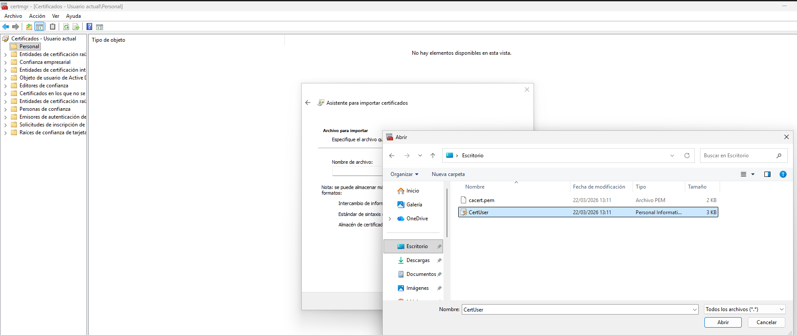
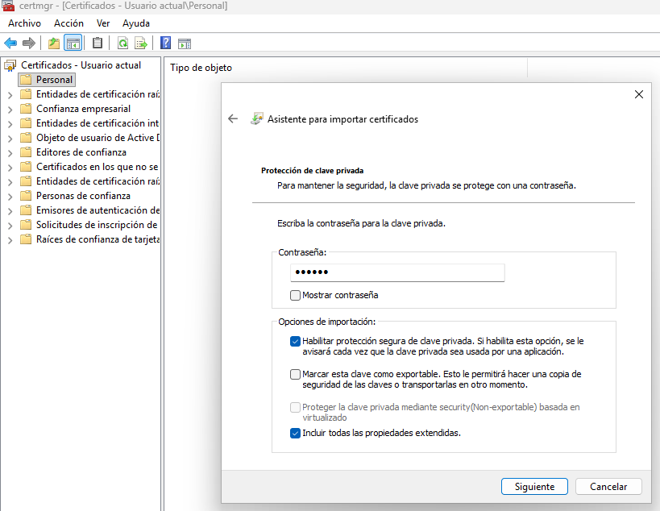
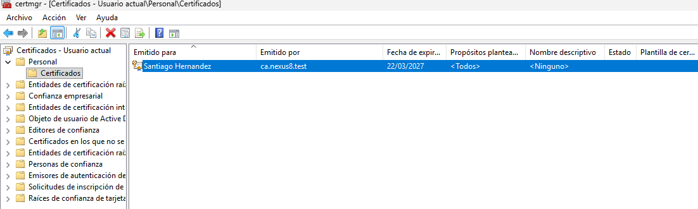

***

## 9. Fase 7 — Firma Digital de un PDF con Adobe Reader

### 9.1. PDF de prueba

*   Crear `Nexus-POC.pdf` (Word → Exportar a PDF, o Imprimir a PDF).

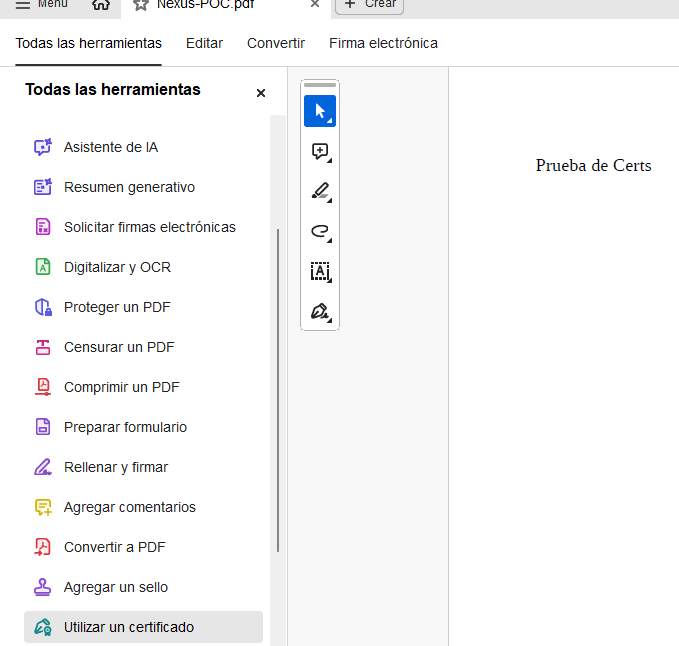

### 9.2. Firma digital (con certificado)

*   Abrir PDF en **Adobe Acrobat Reader**.
*   **Todas las herramientas → Certificados → Firmar digitalmente**.
*   Dibujar área de firma.
*   Elegir el certificado **Santiago Hernandez (emitido por ca.nexus8.test)**.
*   Introducir pass: `123456`.
*   Guardar como `Nexus-POC-SIGNED.pdf`.

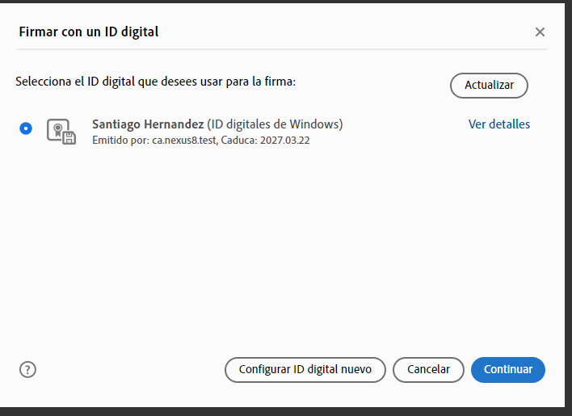

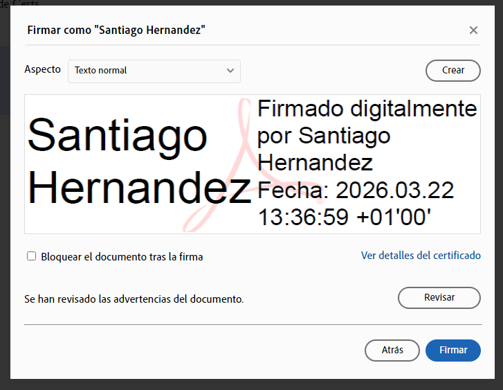

Gaurdamos con el nombre correspondiente:

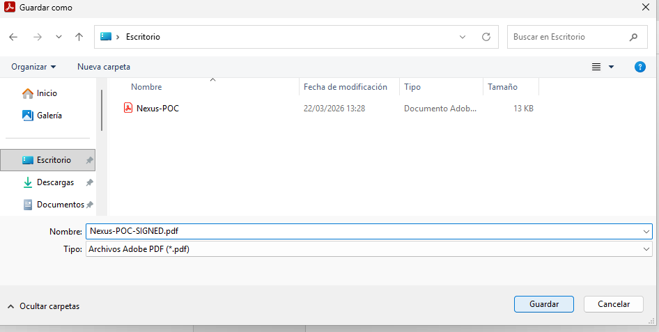

Damos a Permitir:

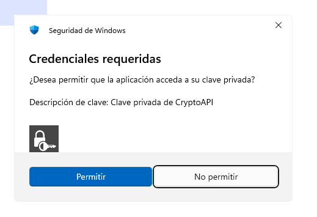

Luego se añadira en el cuadro seleccionado:

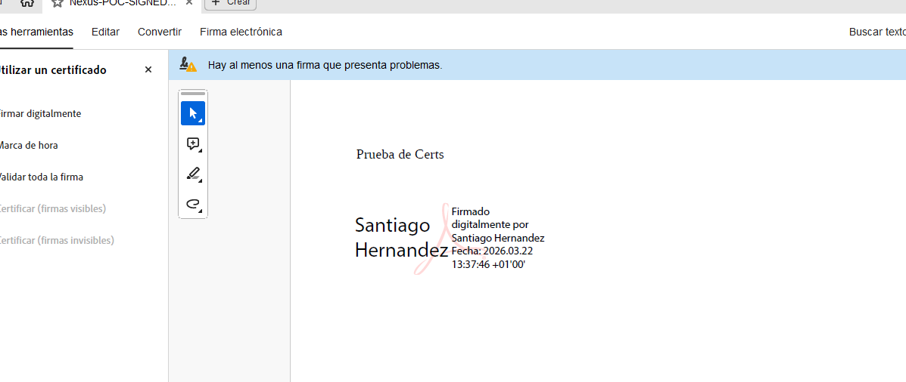

### 9.3. Verificación

*   **Panel de firmas** → Comprobar:
    *   Integridad: **sin modificaciones desde la firma.**
    *   Emisor: **ca.nexus8.test**.
    *   Estado: **válida** o **validez desconocida** (por almacén interno de Adobe).
    *   *Aviso de capas*: puede aparecer, **no afecta**.

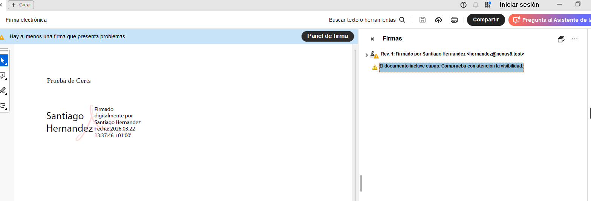

> Nota: si deseas que Adobe marque **“firma válida”** sin “identidad desconocida”, importa `cacert.pem` en **Adobe → Edición → Preferencias → Firmas → Identidades y certificados de confianza → Más… → Certificados de confianza → Importar → “Usar este certificado como raíz de confianza”**. **No es obligatorio para la práctica.**

***

## 10 NOTA:  Diferencias Clave: **Clave Pública vs Clave Privada**

*   **Clave Privada**
    *   Secreta. Solo la posee el titular (CA o usuario).
    *   **Firma** documentos (o emite certificados en el caso de la CA).
    *   Su exposición compromete la identidad.

*   **Clave Pública**
    *   Compartible.
    *   **Verifica** firmas.
    *   En la CA es el **certificado raíz** (se distribuye para confiar en la CA).
    *   En el usuario, va dentro del certificado personal emitido por la CA.

En este proceso:

*   La **CA** usa su **clave privada** para **firmar** el certificado del usuario.
*   El **cliente** usa su **clave privada** para **firmar** el PDF.
*   **Acrobat/Windows** usan las **claves públicas** (certificados) para **verificar** las firmas.

***


## 11. Conclusión

Se ha desplegado una **PKI corporativa** con **CA interna** en Ubuntu, se ha emitido un certificado de usuario, instalado en Windows 11 y usado para **firmar digitalmente** PDFs con **Adobe Acrobat Reader**.  
La solución cumple los objetivos de **integridad, autenticidad y no repudio** en un entorno corporativo controlado.

***
