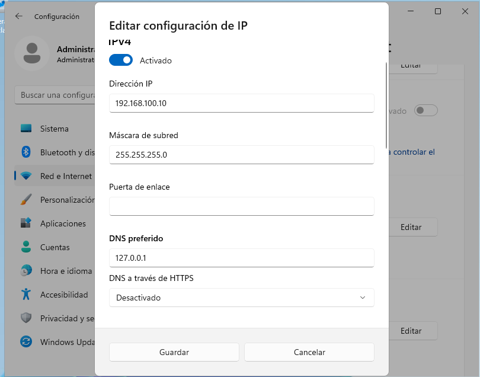
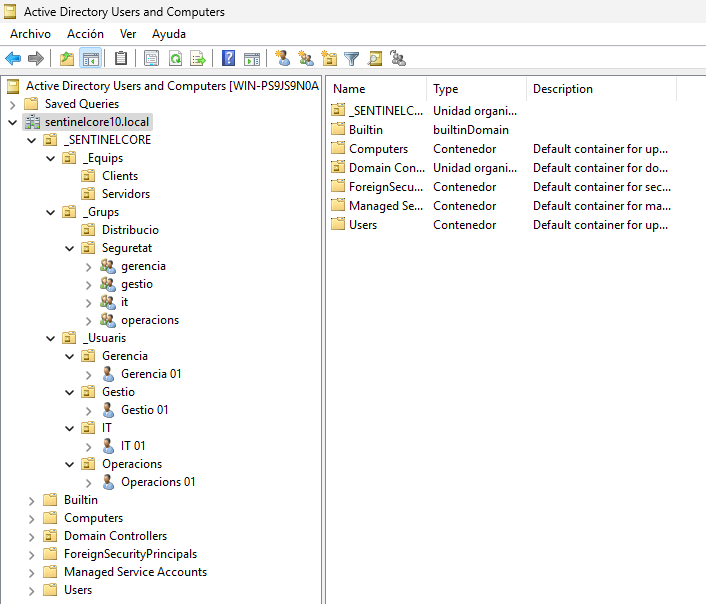
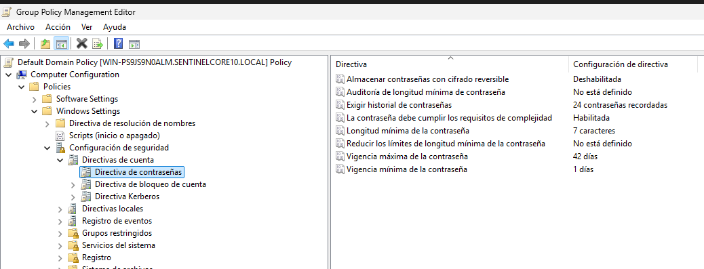
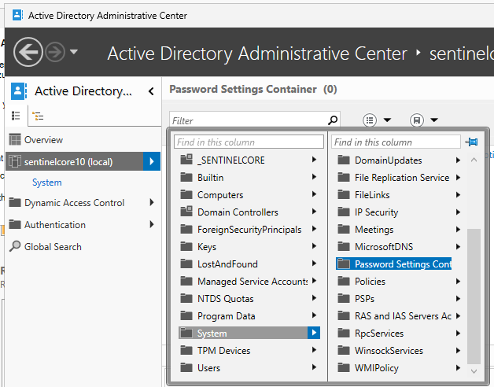
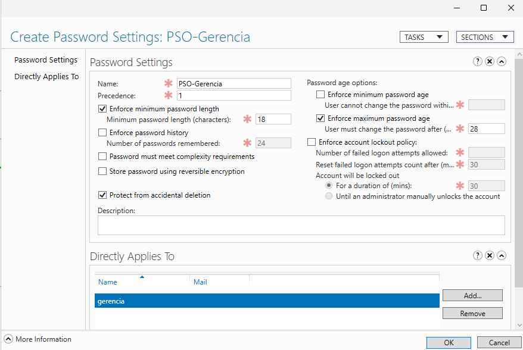
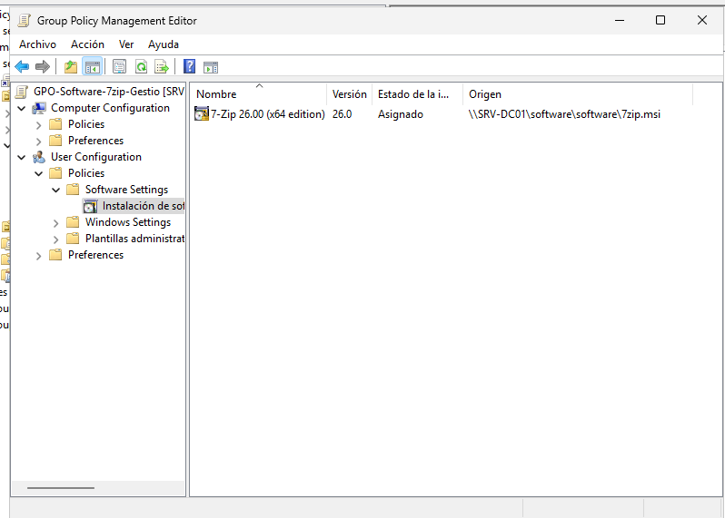
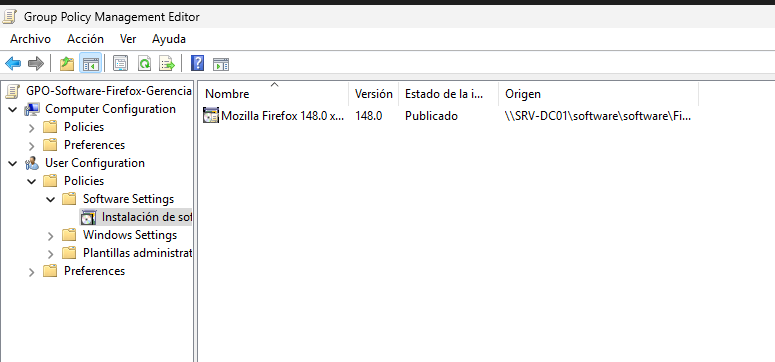
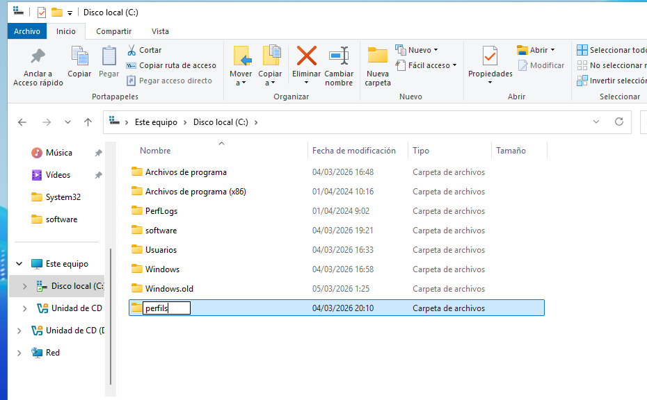
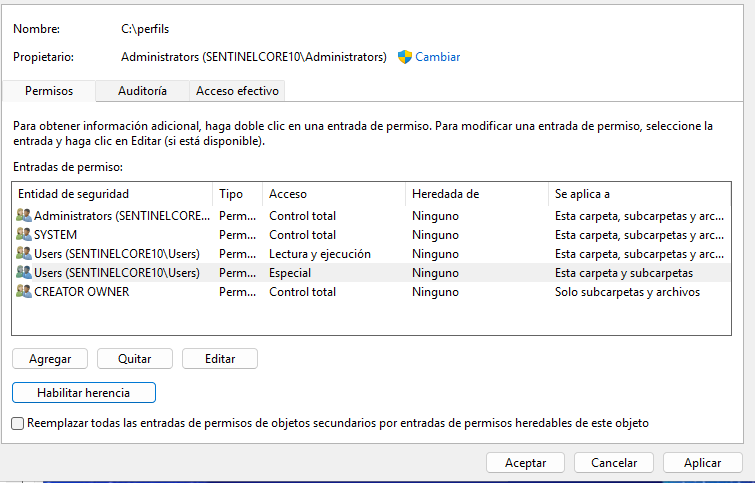

## T07 – Administració Avançada i Seguretat Corporativa

**Empresa:** TransLògic S.A.  
**Consultora:** SentinelCore IT  
**Documento:** Informe de Implementación de Infraestructura Active Directory  
**Fecha:** Marzo 2026

***

# 1. Objetivo general

Este documento describe la implantación completa de una infraestructura corporativa basada en Active Directory, cumpliendo los requisitos de seguridad, movilidad, gestión de software y delegación solicitados por TransLògic S.A. El informe está organizado por fases, proporcionando tanto el diseño técnico como los pasos operativos aplicados.

***

# 2. Preparación del entorno

Se desplegaron dos máquinas virtuales:

*   **SRV-DC01** – Windows Server 2019 (controlador de dominio y servidor de archivos)
*   **CLIENTE-W11** – Windows 11 Pro (estación de trabajo de pruebas)

## Configuración de red en VirtualBox

Ambas máquinas se configuraron con:

*   Adaptador 1: NAT (acceso a Internet)
*   Adaptador 2: Red interna (nombre: **intnet**)

## Configuración del servidor

Ethernet (NAT): Automática  
Ethernet 2 (intnet):

    IP: 192.168.100.10
    Máscara: 255.255.255.0
    Puerta de enlace: —
    DNS: 127.0.0.1

***

# 3. Estructura de OU

La organización se estructuró de forma profesional y orientada a seguridad, delegación y administración eficiente.

    _SENTINELCORE
       |_Usuaris
           |_Gerencia
           |_Gestio
           |_Operacions
           |_IT

       |_Equips
           |_Clients
           |_Servidors

       |_Grups
           |_Seguretat
           |_Distribucio

Justificación:  
La separación entre usuarios, equipos y grupos facilita el enlace de GPOs, delegación granular, y la correcta aplicación de PSO y políticas corporativas.

***

# 4. Implementación del dominio

Dominio creado:

    sentinelcore10.local

Características:

*   Nivel funcional: Windows Server 
*   DNS integrado
*   Global Catalog habilitado

***

# 5. Creación de usuarios y grupos

## 5.1 Grupos (en \_Grups → Seguretat)

*   gerencia
*   gestio
*   operacions
*   it

Todos: Global Security Group.

## 5.2 Usuarios (en su OU correspondiente)

Ejemplo:

    Usuario: Gestio 01
    Login: gst01
    Contraseña: P4ssw0rd!
    Grupo: gestio

***

# 6. Políticas de contraseñas

## 6.1 Política global (Default Domain Policy)

Ruta:

    Computer Configuration -> Policies -> Windows Settings -> Security Settings -> Account Policies -> Password Policy

Configurado:

*   Minimum password length: **8 caracteres**

Justificación:  
Requisito explícito del cliente y de auditoría básica.

***

## 6.2 Política avanzada para Gerencia (VIP) mediante PSO

Creada en:

    Active Directory Administrative Center -> Password Settings Container
    

Parámetros:

*   Nombre: **PSO-Gerencia**
*   Precedence: 1
*   Password length: **18 caracteres**
*   Maximum password age: **28 días**
*   Complexity: Desactivada
*   Apply directly to: Grupo **gerencia**

Todas las directrices VIP aplicadas mediante PSO, sin afectar a GPO globales.

***

# 7. GPO 3 (Bonus): Política de Seguridad Proactiva

GPO aplicada a OU **Operacions**:

Nombre:

    GPO-Bonus-LockScreen-Operacions

Política aplicada:

    User Configuration → Policies → Administrative Templates → Control Panel → Personalization

Configuración:

*   "Screen saver timeout": 300 segundos
*   "Force specific screen saver": habilitado
*   "Password protect the screen saver": habilitado

Justificación:  
El personal de almacén trabaja en áreas abiertas donde los equipos pueden quedar desatendidos. Una política de bloqueo automático reduce el riesgo de accesos no autorizados.  
Cumple el máximo nivel de la rúbrica (4 puntos).

***

# 8. Despliegue de software corporativo

## 8.1 Carpeta de distribución

Ruta:

    \\SRV-DC01\software

Permisos:

*   Domain Computers: Lectura
*   NTFS: SYSTEM/Admins control total, Domain Computers lectura

MSI incluidos:

*   7zip MSI
*   Firefox MSI Enterprise

***

## 8.2 GPO 4: Despliegue Assignat (7zip)

Enlace:

    _SENTINELCORE → _Usuaris → Gestio

Ruta UNC:

    \\SRV-DC01\software\software\7zip.msi
    

Tipo:  
Assigned

***

## 8.3 GPO 5: Despliegue Publicat (Firefox)

Enlace:

    _SENTINELCORE → _Usuaris → Gerencia

Ruta UNC:

    \\SRV-DC01\software\software\firefox.msi
    

Tipo:  
Published
 
Firefox aparece correctamente en el Panel de Control → "Instalar desde la red".

***

# 9. Perfiles móviles (Gestio)

## 9.1 Carpeta compartida

    C:\perfils
    

Permisos compartidos:

*   Authenticated Users: Lectura

Permisos NTFS finales:

*   Administrators: Control total
*   SYSTEM: Control total
*   CREATOR OWNER: Control total (subcarpetas y archivos)
*   Authenticated Users: Lectura + Mostrar contenido + Crear carpetas / anexar datos

## 9.2 Asignación del perfil móvil

En el usuario **gst01**:

    Profile path: \\SRV-DC01\perfils\gst01

## 9.3 Resultado esperado

Al iniciar sesión desde el cliente, se crea:

    C:\perfils\gst01.V6

***

# 10. Redirección de Documentos

## 10.1 Carpetas Home

Plantilla:

    \\SRV-DC01\home\%username%

Con permisos NTFS adecuados.

## 10.2 GPO

    User Configuration → Policies → Windows Settings → Folder Redirection → Documents

Modo:  
Redirect to user’s home folder

Validación:  
Crear un archivo en “Documents” del cliente y verificar que aparece en el servidor.

***

# 11. Delegación administrativa (adminOU)

## 11.1 Creación

    adminOU (usuario estándar)

## 11.2 Delegación

En:

    _SENTINELCORE → Delegate Control

Permisos delegados:

*   Reset passwords
*   Modify group membership

Pruebas:

*   Puede resetear contraseña
*   No puede crear usuarios (mensaje de denegación)

Esto cumple los 4 puntos de la rúbrica.

***

# 12. Pruebas operativas

## 12.1 gpresult /r

Comprueba que las GPOs aplican según usuario.

## 12.2 Software

*   7zip visible como instalado según la política asignada.
*   Firefox visible como software publicado.

## 12.3 Perfil móvil

Carpeta creada correctamente en el servidor.

## 12.4 Redirección

Documentos del usuario almacenados en el Home Folder.

## 12.5 Delegación

adminOU puede cambiar contraseñas y grupos, pero no crear usuarios.

***

# 13. Nota técnica: Conversión de EXE a MSI

Cuando una aplicación solo dispone de instalador EXE, se debe empaquetar en MSI para cumplir estándares corporativos de despliegue por GPO.

Herramientas profesionales recomendadas:

*   Advanced Installer
*   EMCO MSI Package Builder
*   WiX Toolset
*   MSIX Packaging Tool

Proceso general:

1.  Captura del instalador EXE mediante un repackager.
2.  Generación del paquete MSI con sus componentes, claves de registro y archivos.
3.  Pruebas en máquinas limpias.
4.  Firma digital del MSI.

***

# 14. Conclusión

Se ha implementado una solución completa de Active Directory para TransLògic S.A., incluyendo:

*   Infraestructura segura de dominio
*   Políticas de contraseñas globales y específicas
*   Despliegue automatizado de software corporativo
*   Perfiles móviles y Home Folders
*   Redirección de datos críticos
*   Delegación granular para soporte
*   GPO proactiva adaptada al entorno logístico

El sistema queda preparado para auditorías, escalado y nuevas implementaciones futuras.

***

**“Quiero el PDF final”** o  
**“Quiero que insertes mis capturas”**

