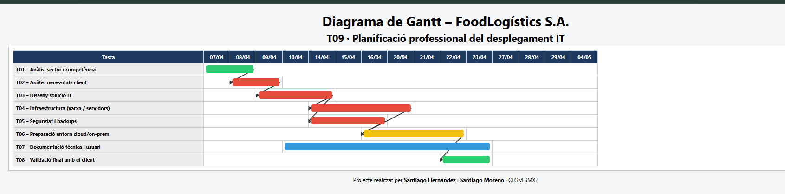

# Justificación del Diagrama de Gantt

**Projecte: FoodLogístics S.A. – T09 Estimació temporal**

## 1. Coherència i qualitat de la planificació

La planificació del projecte s’ha definit a partir d’un anàlisi realista de les tasques necessàries per al desplegament IT de FoodLogístics S.A., evitant una visió lineal simplificada.  
Les tasques s’organitzen seguint un ordre lògic: **anàlisi → disseny → implementació → validació**, identificant correctament les **dependències obligatòries** entre fases.

El diagrama mostra clarament que:

*   **T02 depèn de T01**, ja que no es poden definir necessitats sense conèixer el context.
*   **T03 depèn totalment de T02**, perquè el disseny tècnic es basa en requisits validats.
*   **T04 i T05 depenen de T03**, però es poden executar **en paral·lel**, ja que comparteixen entrada però no interfereixen entre si.
*   **T06 depèn de T04 i T05**, constituint un punt clau del projecte.
*   **T08 només pot executar-se un cop finalitzades totes les tasques crítiques**, garantint una validació real.

Aquest enfocament permet detectar clarament el **camí crític del projecte**:

> **T01 → T02 → T03 → T04/T05 → T06 → T08**

Qualsevol retard en una d’aquestes tasques impactaria directament en la data final, fet que demostra una comprensió clara dels **colls d’ampolla** i dels riscos associats.

La documentació (T07) es planifica com a **tasca transversal**, iniciant-se quan el disseny està definit, per assegurar traçabilitat i qualitat contínua, i no com una tasca final improvisada.

***

## 2. Estimació d’esforç i realisme

Les durades assignades a cada tasca responen a un criteri **realista** i no exclusivament teòric.  
En l’estimació s’han tingut en compte factors reals com:

*   temps de comprensió i coordinació,
*   proves i resolució d’errors,
*   interrupcions pròpies de l’entorn lectiu,
*   validacions parcials i ajustos.

Aquest enfocament evita una planificació excessivament optimista i reflecteix millor el funcionament real d’un projecte IT.  
L’ús d’IA ha estat **crític i reinterpretat pel grup**, utilitzat com a suport per contrastar idees, però adaptant les decisions a la nostra experiència i al context específic del projecte.

***

## 3. Qualitat tècnica i representació visual del diagrama de Gantt

El diagrama de Gantt s’ha implementat amb una representació **visual, clara i professional**, similar a eines empresarials de gestió de projectes.  
Inclou explícitament:

*   tasques identificades,
*   duracions reals,
*   paral·lelismes viables,
*   dependències mostrades mitjançant **fletxes visuals**, que permeten entendre d’un cop d’ull el flux del projecte.

Els colors diferencien el **tipus de tasca** (estratègica, crítica, tècnica i transversal), facilitant la lectura ràpida del pes i impacte de cada fase.  
La disposició temporal es basa en **dies reals de classe**, fet que garanteix coherència total entre la planificació explicada i el diagrama presentat.

El diagrama és coherent amb tota la planificació descrita al projecte i compleix una doble funció:

*   documentar el projecte,
*   i servir com a eina de control i seguiment.

***

## 4. Conclusió

Aquest diagrama no és una simple representació gràfica, sinó una **planificació raonada**, amb dependències justificades, estimacions realistes i una visualització clara del camí crític.  
Reflecteix un enfocament propi d’un **equip IT professional**, capaç d’organitzar el treball, anticipar riscos i gestionar el temps de manera eficient.

